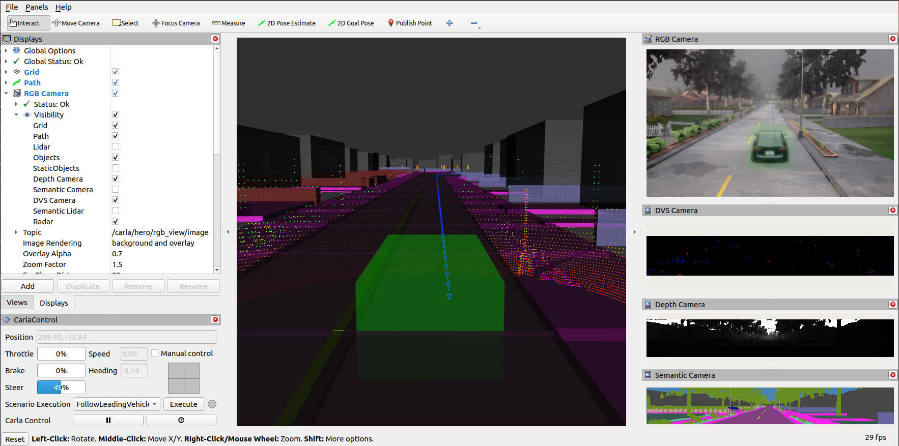

# ROS/ROS2 bridge for CARLA simulator

 This ROS package is a bridge that enables two-way communication between ROS and CARLA. The information from the CARLA server is translated to ROS topics. In the same way, the messages sent between nodes in ROS get translated to commands to be applied in CARLA.

**This version requires CARLA 0.9.13**

## Features

- Provide Sensor Data (Lidar, Semantic lidar, Cameras (depth, segmentation, rgb, dvs), GNSS, Radar, IMU)
- Provide Object Data (Transforms (via [tf](http://wiki.ros.org/tf)), Traffic light status, Visualization markers, Collision, Lane invasion)
- Control AD Agents (Steer/Throttle/Brake)
- Control CARLA (Play/pause simulation, Set simulation parameters)

## Getting started and documentation

Installation instructions and further documentation of the ROS bridge and additional packages are found [__here__](https://carla.readthedocs.io/projects/ros-bridge/en/latest/).
