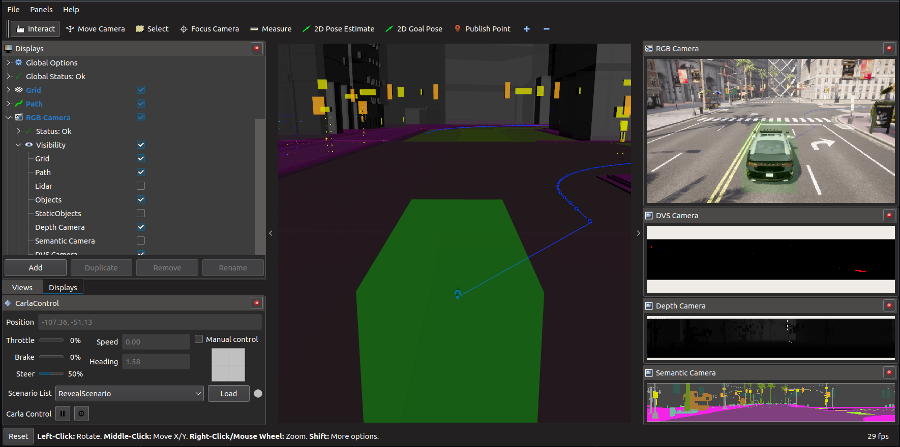

# ROS/ROS2 bridge for CARLA simulator

[](https://github.com/carla-simulator/ros-bridge)
[](https://travis-ci.com/carla-simulator/ros-bridge)
[](https://github.com/carla-simulator/ros-bridge/blob/master/LICENSE)
[](https://github.com/carla-simulator/ros-bridge/releases/latest)

This ROS package aims at providing a simple ROS/ROS2 bridge for CARLA simulator.



**This version requires CARLA 0.9.11**

## Features

- Provide Sensor Data (Lidar, Semantic lidar, Cameras (depth, segmentation, rgb, dvs), GNSS, Radar, IMU)
- Provide Object Data (Transforms (via [tf](http://wiki.ros.org/tf)), Traffic light status, Visualization markers, Collision, Lane invasion)
- Control AD Agents (Steer/Throttle/Brake)
- Control CARLA (Play/pause simulation, Set simulation parameters)

### Additional Functionality

Beside the bridging functionality, there are many more features provided in separate packages.

| Name                              | Description                                                                                             |
| --------------------------------- | ------------------------------------------------------------------------------------------------------- |
| [Carla Spawn Actors](carla_spawn_objects/README.md) | Provides a generic way to spawn actors |
| [Carla Manual Control](carla_manual_control/README.md) | A ROS-based visualization and control tool for an ego vehicle (similar to carla_manual_control.py provided by CARLA) |
| [Carla Waypoint Publisher](carla_waypoint_publisher/README.md) | Provide routes and access to the Carla waypoint API |
| [Carla ROS Scenario Runner](carla_ros_scenario_runner/README.md) | ROS node that wraps the functionality of the CARLA [scenario runner](https://github.com/carla-simulator/scenario_runner) to execute scenarios. |
| [Carla Ackermann Control](carla_ackermann_control/README.md) | A controller to convert ackermann commands to steer/throttle/brake|
| [Carla AD Agent](carla_ad_agent/README.md) | A basic AD agent, that follows a route, avoids collisions with other vehicles and stops on red traffic lights. |
| [Carla Walker Agent](carla_walker_agent/README.md) | A basic walker agent, that follows a route. |
| [RVIZ Carla Plugin](rviz_carla_plugin/README.md) | A [RVIZ](http://wiki.ros.org/rviz) plugin to visualize/control CARLA. |
| [RQT Carla Plugin](rqt_carla_plugin/README.md) | A [RQT](http://wiki.ros.org/rqt) plugin to control CARLA. |

For a quick overview, after following the [Setup section](#setup), please run the [CARLA AD Demo](carla_ad_demo/README.md). It provides a ready-to-use demonstrator of many of the features.

## Setup

ROS and ROS2 are supported by using separate implementations with a [common interface](ros_compatibility).

Please follow the instructions:

* [ROS](README.ros.md)
* [ROS2](README.ros2.md)

## Configuration

Certain parameters can be set within the launch file [carla_ros_bridge.launch](carla_ros_bridge/launch/carla_ros_bridge.launch).

If the rolename is within the list specified by argument `ego_vehicle_role_name`, it is interpreted as an controllable ego vehicle and all relevant ROS topics are created.

### Map

The bridge is able to load a CARLA map by setting the launch-file parameter ```town```. Either specify an available CARLA Town (e.g. 'Town01') or a OpenDRIVE file (with ending '.xodr').

### Mode

The bridge operates by default in CARLA synchronous mode, waiting for all sensor data that is expected within the current frame to ensure reproducible results. The bridge should only be used in this mode.

**CAUTION**: In synchronous mode, only one CARLA client is allowed to tick. The ROS bridge will by default be the only client allowed to tick the CARLA server unless passive mode is enabled. Enabling passive mode will make the ROS bridge step back and allow another client to tick the CARLA server.

Additionally you might set `synchronous_mode_wait_for_vehicle_control_command` to `true` to wait for a vehicle control command before executing the next tick.

The usage of the asynchronous mode is discouraged. Users may enable this mode running the bridge in the following way:

```sh
# ROS1
roslaunch carla_ros_bridge carla_ros_bridge.launch synchronous_mode:=False

# ROS2
ros2 launch carla_ros_bridge carla_ros_bridge.launch.py synchronous_mode:=False
```


###### Control Synchronous Mode

It is possible to control the simulation execution:

-   Pause/Play
-   Execute single step

The following topic allows to control the stepping.

| Topic            | Type                                                       |
| ---------------- | ---------------------------------------------------------- |
| `/carla/control` | [carla_msgs.CarlaControl](https://github.com/carla-simulator/ros-carla-msgs/tree/master/msg/CarlaControl.msg) |

A [CARLA Control rqt plugin](rqt_carla_control/README.md) is available to publish to the topic.

## Available ROS Topics

### Sensors

Sensor data is provided via topic with prefix `/carla/[<PARENTS ROLE NAME>]/<SENSOR ROLE NAME>/[<TOPIC NAME>]`

The following sensors are available:

#### CARLA sensors

##### RGB camera

| Topic                                                          | Type                                                                                   |
| -------------------------------------------------------------- | -------------------------------------------------------------------------------------- |
| `/carla/[<PARENT ROLE NAME>]/<SENSOR ROLE NAME>/image` | [sensor_msgs.Image](http://docs.ros.org/api/sensor_msgs/html/msg/Image.html)           |
| `/carla/[<PARENT ROLE NAME>]/<SENSOR ROLE NAME>/camera_info` | [sensor_msgs.CameraInfo](http://docs.ros.org/api/sensor_msgs/html/msg/CameraInfo.html) |

##### Depth camera

| Topic                                                          | Type                                                                                   |
| -------------------------------------------------------------- | -------------------------------------------------------------------------------------- |
| `/carla/[<PARENT ROLE NAME>]/<SENSOR ROLE NAME>/image` | [sensor_msgs.Image](http://docs.ros.org/api/sensor_msgs/html/msg/Image.html)           |
| `/carla/[<PARENT ROLE NAME>]/<SENSOR ROLE NAME>/camera_info` | [sensor_msgs.CameraInfo](http://docs.ros.org/api/sensor_msgs/html/msg/CameraInfo.html) |

##### Semantic segmentation camera

| Topic                                                          | Type                                                                                   |
| -------------------------------------------------------------- | -------------------------------------------------------------------------------------- |
| `/carla/[<PARENT ROLE NAME>]/<SENSOR ROLE NAME>/image` | [sensor_msgs.Image](http://docs.ros.org/api/sensor_msgs/html/msg/Image.html)           |
| `/carla/[<PARENT ROLE NAME>]/<SENSOR ROLE NAME>/camera_info` | [sensor_msgs.CameraInfo](http://docs.ros.org/api/sensor_msgs/html/msg/CameraInfo.html) |

##### DVS camera

| Topic                                                          | Type                                                                                   |
| -------------------------------------------------------------- | -------------------------------------------------------------------------------------- |
| `/carla/[<PARENT ROLE NAME>]/<SENSOR ROLE NAME>/events` | [sensor_msgs.PointCloud2](http://docs.ros.org/en/api/sensor_msgs/html/msg/PointCloud2.html)           |
| `/carla/[<PARENT ROLE NAME>]/<SENSOR ROLE NAME>/image` | [sensor_msgs.Image](http://docs.ros.org/api/sensor_msgs/html/msg/Image.html)           |
| `/carla/[<PARENT ROLE NAME>]/<SENSOR ROLE NAME>/camera_info` | [sensor_msgs.CameraInfo](http://docs.ros.org/api/sensor_msgs/html/msg/CameraInfo.html) |

##### Lidar

| Topic                                                     | Type                                                                                     |
| --------------------------------------------------------- | ---------------------------------------------------------------------------------------- |
| `/carla/[<PARENT ROLE NAME>]/<SENSOR ROLE NAME>` | [sensor_msgs.PointCloud2](http://docs.ros.org/api/sensor_msgs/html/msg/PointCloud2.html) |

##### Semantic lidar

| Topic                                                     | Type                                                                                     |
| --------------------------------------------------------- | ---------------------------------------------------------------------------------------- |
| `/carla/[<PARENT ROLE NAME>]/<SENSOR ROLE NAME>` | [sensor_msgs.PointCloud2](http://docs.ros.org/api/sensor_msgs/html/msg/PointCloud2.html) |

##### Radar

| Topic                                                          | Type                                                                                   |
| -------------------------------------------------------------- | -------------------------------------------------------------------------------------- |
| `/carla/[<PARENT ROLE NAME>]/<SENSOR ROLE NAME>` | [sensor_msgs.PointCloud2](http://docs.ros.org/api/sensor_msgs/html/msg/PointCloud2.html) |

##### IMU

| Topic                    | Type                                                                              |
| ------------------------ | --------------------------------------------------------------------------------- |
| `/carla/[<PARENT ROLE NAME>]/<SENSOR ROLE NAME>` | [sensor_msgs.Imu](https://docs.ros.org/api/sensor_msgs/html/msg/Imu.html) |

##### GNSS

| Topic                                            | Type                                                                                 | Description           |
| ------------------------------------------------ | ------------------------------------------------------------------------------------ | --------------------- |
| `/carla/[<PARENT ROLE NAME>]/<SENSOR ROLE NAME>` | [sensor_msgs.NavSatFix](http://docs.ros.org/api/sensor_msgs/html/msg/NavSatFix.html) | publish gnss location |

##### Collision Sensor

| Topic                          | Type                                                                     | Description              |
| ------------------------------ | ------------------------------------------------------------------------ | ------------------------ |
| `/carla/[<PARENT ROLE NAME>]/<SENSOR ROLE NAME>` | [carla_msgs.CarlaCollisionEvent](https://github.com/carla-simulator/ros-carla-msgs/tree/master/msg/CarlaCollisionEvent.msg) | publish collision events |

##### Lane Invasion Sensor

| Topic                              | Type                                                                           | Description                     |
| ---------------------------------- | ------------------------------------------------------------------------------ | ------------------------------- |
| `/carla/[<PARENT ROLE NAME>]/<SENSOR ROLE NAME>` | [carla_msgs.CarlaLaneInvasionEvent](https://github.com/carla-simulator/ros-carla-msgs/tree/master/msg/CarlaLaneInvasionEvent.msg) | publish events on lane-invasion |

#### Pseudo sensors

##### TF Sensor

The tf data for the ego vehicle is published when this pseudo sensor is spawned.

**Note**: Sensors publish the tf data when the measurement is done. The `child_frame_id` corresponds with the prefix of the sensor topics.

##### Odometry Sensor

| Topic                        | Type                                                                                                     | Description                                      |
| ---------------------------- | -------------------------------------------------------------------------------------------------------- | ------------------------------------------------ |
| `/carla/<PARENT ROLE NAME>/<SENSOR ROLE NAME>` | [nav_msgs.Odometry](http://docs.ros.org/en/api/nav_msgs/html/msg/Odometry.html) | odometry of the parent actor |

##### Speedometer Sensor

| Topic                        | Type                                                                                                     | Description                                      |
| ---------------------------- | -------------------------------------------------------------------------------------------------------- | ------------------------------------------------ |
| `/carla/<PARENT ROLE NAME>/<SENSOR ROLE NAME>` | [std_msgs.Float32](http://docs.ros.org/en/api/std_msgs/html/msg/Float32.html) | speed of the parent actor. Units: m/s |

##### Map Sensor

| Topic                        | Type                                                                                                     | Description                                      |
| ---------------------------- | -------------------------------------------------------------------------------------------------------- | ------------------------------------------------ |
| `/carla/[<PARENT ROLE NAME>]/<SENSOR ROLE NAME>` | [std_msgs.String](http://docs.ros.org/en/api/std_msgs/html/msg/String.html) | provides the OpenDRIVE map as a string on a latched topic. |

##### Object Sensor

| Topic                        | Type                                                                                                     | Description                                      |
| ---------------------------- | -------------------------------------------------------------------------------------------------------- | ------------------------------------------------ |
| `/carla/[<PARENT ROLE NAME>]/<SENSOR ROLE NAME>` | [derived_object_msgs.ObjectArray](http://docs.ros.org/api/derived_object_msgs/html/msg/ObjectArray.html) | publishes all vehicles and walker. If attached to a parent, the parent is not contained. |

##### Marker Sensor

| Topic                        | Type                                                                                                     | Description                                      |
| ---------------------------- | -------------------------------------------------------------------------------------------------------- | ------------------------------------------------ |
| `/carla/[<PARENT ROLE NAME>]/<SENSOR ROLE NAME>` | [visualization_msgs.Marker](http://docs.ros.org/api/visualization_msgs/html/msg/Marker.html) | visualization of vehicles and walkers |

##### Traffic Lights Sensor

| Topic                        | Type                                                                                                     | Description                                      |
| ---------------------------- | -------------------------------------------------------------------------------------------------------- | ------------------------------------------------ |
| `/carla/[<PARENT ROLE NAME>]/<SENSOR ROLE NAME>/status` | [carla_msgs.CarlaTrafficLightStatusList](https://github.com/carla-simulator/ros-carla-msgs/tree/master/msg/CarlaTrafficLightStatusList.msg)             | list of all traffic lights with their status |
| `/carla/[<PARENT ROLE NAME>]/<SENSOR ROLE NAME>/info` | [carla_msgs.CarlaTrafficLightInfoList](https://github.com/carla-simulator/ros-carla-msgs/tree/master/msg/CarlaTrafficLightInfoList.msg)             | static information for all traffic lights (e.g. position)|

##### Actor List Sensor

| Topic                        | Type                                                                                                     | Description                                      |
| ---------------------------- | -------------------------------------------------------------------------------------------------------- | ------------------------------------------------ |
| `/carla/[<PARENT ROLE NAME>]/<SENSOR ROLE NAME>` | [carla_msgs.CarlaActorList](https://github.com/carla-simulator/ros-carla-msgs/tree/master/msg/CarlaActorList.msg) | list of all carla actors |

##### Actor Control Sensor

This pseudo-sensor allows to control the position and velocity of the actor it is attached to (e.g. an ego_vehicle) by publishing pose and velocity within Pose and Twist datatypes.
CAUTION: This control method does not respect the vehicle constraints. It allows movements impossible in the real world, like flying or rotating.
Currently this sensor applies the complete linear vector, but only the yaw from angular vector.

| Topic                        | Type                                                                                                     | Description                                      |
| ---------------------------- | -------------------------------------------------------------------------------------------------------- | ------------------------------------------------ |
| `/carla/[<PARENT ROLE NAME>]/<SENSOR ROLE NAME>/set_transform` | [geometry_msgs.Pose](https://docs.ros.org/en/api/geometry_msgs/html/msg/Pose.html) | transform to apply to the sensor's parent |
| `/carla/[<PARENT ROLE NAME>]/<SENSOR ROLE NAME>/set_target_velocity` | [geometry_msgs.Twist](https://docs.ros.org/en/api/geometry_msgs/html/msg/Twist.html) | velocity (angular and linear) to apply to the sensor's parent |

### Ego Vehicle

#### Control

| Topic                                                             | Type                                                                           |
| ----------------------------------------------------------------- | ------------------------------------------------------------------------------ |
| `/carla/<ROLE NAME>/vehicle_control_cmd` (subscriber)             | [carla_msgs.CarlaEgoVehicleControl](https://github.com/carla-simulator/ros-carla-msgs/tree/master/msg/CarlaEgoVehicleControl.msg) |
| `/carla/<ROLE NAME>/vehicle_control_cmd_manual` (subscriber)      | [carla_msgs.CarlaEgoVehicleControl](https://github.com/carla-simulator/ros-carla-msgs/tree/master/msg/CarlaEgoVehicleControl.msg) |
| `/carla/<ROLE NAME>/vehicle_control_manual_override` (subscriber) | [std_msgs.Bool](http://docs.ros.org/api/std_msgs/html/msg/Bool.html)           |
| `/carla/<ROLE NAME>/vehicle_status`                               | [carla_msgs.CarlaEgoVehicleStatus](https://github.com/carla-simulator/ros-carla-msgs/tree/master/msg/CarlaEgoVehicleStatus.msg)   |
| `/carla/<ROLE NAME>/vehicle_info`                                 | [carla_msgs.CarlaEgoVehicleInfo](https://github.com/carla-simulator/ros-carla-msgs/tree/master/msg/CarlaEgoVehicleInfo.msg)       |

There are two modes to control the vehicle.

1.  Normal Mode (reading commands from `/carla/<ROLE NAME>/vehicle_control_cmd`)
2.  Manual Mode (reading commands from `/carla/<ROLE NAME>/vehicle_control_cmd_manual`)

This allows to manually override a Vehicle Control Commands published by a software stack. You can toggle between the two modes by publishing to `/carla/<ROLE NAME>/vehicle_control_manual_override`.

[carla_manual_control](carla_manual_control/) makes use of this feature.

For testing purposes, you can stear the ego vehicle from the commandline by publishing to the topic `/carla/<ROLE NAME>/vehicle_control_cmd`.

Examples for a ego vehicle with role_name 'ego_vehicle':

Max forward throttle:

    # for ros1
     rostopic pub /carla/ego_vehicle/vehicle_control_cmd carla_msgs/CarlaEgoVehicleControl "{throttle: 1.0, steer: 0.0}" -r 10
    # for ros2
     ros2 topic pub /carla/ego_vehicle/vehicle_control_cmd carla_msgs/CarlaEgoVehicleControl "{throttle: 1.0, steer: 0.0}" -r 10

Max forward throttle with max steering to the right:

    # for ros1
     rostopic pub /carla/ego_vehicle/vehicle_control_cmd carla_msgs/CarlaEgoVehicleControl "{throttle: 1.0, steer: 1.0}" -r 10
    # for ros2
     ros2 topic pub /carla/ego_vehicle/vehicle_control_cmd carla_msgs/CarlaEgoVehicleControl "{throttle: 1.0, steer: 1.0}" -r 10

The current status of the vehicle can be received via topic `/carla/<ROLE NAME>/vehicle_status`.
Static information about the vehicle can be received via `/carla/<ROLE NAME>/vehicle_info`

##### Carla Ackermann Control

In certain cases, the [Carla Control Command](https://github.com/carla-simulator/ros-carla-msgs/tree/master/msg/CarlaEgoVehicleControl.msg) is not ideal to connect to an AD stack.
Therefore a ROS-based node `carla_ackermann_control` is provided which reads [AckermannDrive](http://docs.ros.org/api/ackermann_msgs/html/msg/AckermannDrive.html) messages.
You can find further documentation [here](carla_ackermann_control/README.md).

### Other topics

| Topic               | Type                                                                                                     | Description                           |
| ------------------- | -------------------------------------------------------------------------------------------------------- | ------------------------------------- |
| `/carla/weather_control` | [carla_msgs.CarlaWeatherParameters](https://github.com/carla-simulator/ros-carla-msgs/tree/master/msg/CarlaWeatherParameters.msg)             | set the CARLA weather parameters|

#### Status of CARLA

| Topic               | Type                                                           | Description                                            |
| ------------------- | -------------------------------------------------------------- | ------------------------------------------------------ |
| `/carla/status`     | [carla_msgs.CarlaStatus](https://github.com/carla-simulator/ros-carla-msgs/tree/master/msg/CarlaStatus.msg)       |                                                        |
| `/carla/world_info` | [carla_msgs.CarlaWorldInfo](https://github.com/carla-simulator/ros-carla-msgs/tree/master/msg/CarlaWorldInfo.msg) | Info about the CARLA world/level (e.g. OPEN Drive map) |

#### Walker

| Topic                                                | Type                                                                         | Description        |
| ---------------------------------------------------- | ---------------------------------------------------------------------------- | ------------------ |
| `/carla/<ID>/walker_control_cmd` (subscriber) | [carla_msgs.CarlaWalkerControl](https://github.com/carla-simulator/ros-carla-msgs/tree/master/msg/CarlaWalkerControl.msg)       | Control a walker   |


### Debug Marker

It is possible to draw markers in CARLA.

Caution: Markers might affect the data published by sensors.

The following markers are supported in 'map'-frame:

-   Arrow (specified by two points)
-   Points
-   Cube
-   Line Strip

| Topic                              | Type                                                                                                   | Description                 |
| ---------------------------------- | ------------------------------------------------------------------------------------------------------ | --------------------------- |
| `/carla/debug_marker` (subscriber) | [visualization_msgs.MarkerArray](http://docs.ros.org/api/visualization_msgs/html/msg/MarkerArray.html) | draw markers in CARLA world |

## Troubleshooting

### ImportError: No module named carla

You're missing Carla Python. Please execute:

    export PYTHONPATH=$PYTHONPATH:<path/to/carla/>/PythonAPI/carla/dist/<your_egg_file>

Please note that you have to put in the complete path to the egg-file including
the egg-file itself. Please use the one, that is supported by your Python version.
Depending on the type of CARLA (pre-build, or build from source), the egg files
are typically located either directly in the PythonAPI folder or in PythonAPI/dist.

Check the installation is successfull by trying to import carla from python:

    python -c 'import carla;print("Success")'

You should see the Success message without any errors.
