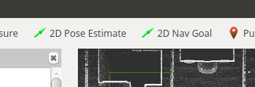

# Carla Spawn Objects

The [`carla_spawn_objects` package](https://github.com/carla-simulator/ros-bridge/tree/master/carla_spawn_objects) is used to spawn actors (vehicles, sensors, walkers) and to attach sensors to them.

- [__Configuration and sensor setup__](#configuration-and-sensor-setup)
    - [Create the configuration](#create-the-configuration)
- [__Spawning Vehicles__](#spawning-vehicles)
    - [Respawning vehicles](#respawning-vehicles)
- [__Spawning Sensors__](#spawning-sensors)
    - [Attach sensors to an existing vehicle](#attach-sensors-to-an-existing-vehicle)

---

## Configuration and sensor setup

Objects and their attached sensors are defined through a `.json` file. The default location of this file is within `carla_spawn_objects/config/objects.json`. To change the location, pass the path to the file via the private ROS parameter, `objects_definition_file`, when you launch the package:

```sh
    # ROS 1
    roslaunch carla_spawn_objects carla_spawn_objects.launch objects_definition_file:=path/to/objects.json

    # ROS 2
    ros2 launch carla_spawn_objects carla_spawn_objects.launch.py objects_definition_file:=path/to/objects.json
```


### Create the configuration

You can find an example in the [ros-bridge repository][objectsjson] as well as follow this outline to create your own configuration and sensor setup:

```json
{
"objects":
    [
        {
            "type": "<SENSOR-TYPE>",
            "id": "<NAME>",
            "spawn_point": {"x": 0.0, "y": 0.0, "z": 0.0, "roll": 0.0, "pitch": 0.0, "yaw": 0.0},
            <ADDITIONAL-SENSOR-ATTRIBUTES>
        },
        {
            "type": "<VEHICLE-TYPE>",
            "id": "<VEHICLE-NAME>",
            "spawn_point": {"x": -11.1, "y": 138.5, "z": 0.2, "roll": 0.0, "pitch": 0.0, "yaw": -178.7},
            "sensors":
                [
                <SENSORS-TO-ATTACH-TO-VEHICLE>
                ]
        }
        ...
    ]
}
```


!!! Note
    Remember when directly defining positions that ROS uses a [right hand system](https://www.ros.org/reps/rep-0103.html#chirality)

All sensor attributes are defined as described in the [blueprint library](https://carla.readthedocs.io/en/latest/bp_library/).

[objectsjson]: https://github.com/carla-simulator/ros-bridge/blob/master/carla_spawn_objects/config/objects.json

---

## Spawning vehicles

- If no specific spawn point is defined, vehicles will be spawned at a random location.
- To define the position at which a vehicle will be spawned, there are two choices:

    - Pass the desired position to a ROS parameter `spawn_point_<VEHICLE-NAME>`. `<VEHICLE-NAME>` will be the `id` you gave the vehicle in the `.json` file:

            # ROS 1
            roslaunch carla_spawn_objects carla_spawn_objects.launch spawn_point_<VEHICLE-NAME>:=x,y,z,roll,pitch,yaw

            # ROS 2
            ros2 launch carla_spawn_objects carla_spawn_objects.launch.py spawn_point_<VEHICLE-NAME>:=x,y,z,roll,pitch,yaw

    - Define the initial position directly in the `.json` file:

            {
            "type": "vehicle.*",
            "id": "ego_vehicle",
            "spawn_point": {"x": -11.1, "y": 138.5, "z": 0.2, "roll": 0.0, "pitch": 0.0, "yaw": -178.7},
            }

### Respawning vehicles

A vehicle can be respawned to a different location during a simulation by publishing to the topic `/carla/<ROLE NAME>/<CONTROLLER_ID>/initialpose`. To use this functionality:

1. Attach an `actor.pseudo.control` pseudo-actor to the vehicle in the `.json` file. It should have the same `id` value as the value passed as `<CONTROLLER_ID>` used to publish to the topic:

        {
        "type": "vehicle.*",
        "id": "ego_vehicle",
        "sensors":
        [
            {
            "type": "actor.pseudo.control",
            "id": "control"
            }
        ]
        }

2. Launch the `set_inital_pose` node, passing the `<CONTROLLER_ID>` as an argument to the ROS parameter `controller_id` (default = 'control'):

        roslaunch carla_spawn_objects set_initial_pose.launch controller_id:=<CONTROLLER_ID>

3. The preferred way to publish the message to set the new position is by using the __2D Pose Estimate__ button available in the RVIZ interface. You can then click on the viewport of the map to respawn in that position. This will delete the current `ego_vehicle` and respawn it at the specified position.

> 

---

## Spawning Sensors

- The initial position for a sensor should be defined directly in the `.json` file, as shown above for vehicles.
- The spawn point for a sensor attached to a vehicle is considered relative to the vehicle.

### Attach sensors to an existing vehicle

Sensors can be attached to an already existing vehicle. To do so:

1. Define the pseudo sensor `sensor.pseudo.actor_list` in the `.json` file. This will give access to a list of already existing actors.

        ...
        {
            "type": "sensor.pseudo.actor_list",
            "id": "actor_list"
        },

2. Define the rest of the sensors as required.
3. Launch the node with the `spawn_sensors_only` parameter set to True. This will check if an actor with the same `id` and `type` as the one specified in the `.json` file is already active and if so, attach the sensors to this actor.

        # ROS 1
        roslaunch carla_spawn_objects carla_spawn_objects.launch spawn_sensors_only:=True

        # ROS 2
        ros2 launch carla_spawn_objects carla_spawn_objects.launch.py spawn_sensors_only:=True


---

