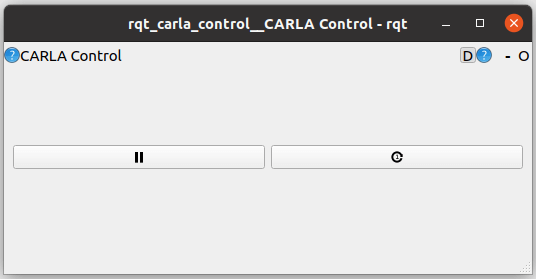

# RQT Carla Plugin

The [RQT plugin](https://github.com/carla-simulator/ros-bridge/tree/master/rqt_carla_control) is a simple interface for pausing, playing and controlling the steps of a simulation. To use it, execute the following command with the ROS-bridge running in synchronous mode:

```
       rqt --standalone rqt_carla_control
``` 

You will be able to control the steps via GUI:

>>>
