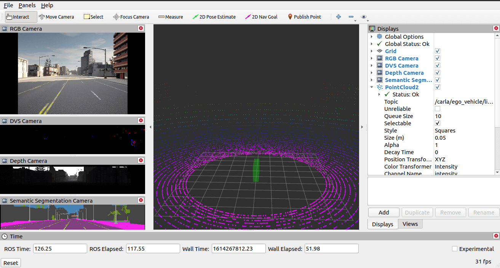

# RVIZ Carla Plugin

The [RVIZ plugin](https://github.com/carla-simulator/ros-bridge/tree/master/rviz_carla_plugin) provides a visualization tool based on the [RVIZ](https://wiki.ros.org/rviz) ROS package.

- [__Run ROS bridge with RVIZ__](#run-ros-bridge-with-rviz)
- [__Features of the RVIZ plugin__](#features-of-the-rviz-plugin)
- [__ROS API__](#ros-api)
    - [Subscriptions](#subscriptions)
    - [Publications](#publications)
    - [Services](#services)

---

## Run ROS bridge with RVIZ



The RVIZ plugin expects an ego vehicle named `ego_vehicle`. To see an example of ROS-bridge working with RVIZ, execute the following commands with a CARLA server running:

__1.__ Start the ROS bridge with RVIZ enabled:

```sh
# ROS 1
roslaunch carla_ros_bridge carla_ros_bridge.launch

# ROS 2
ros2 launch carla_ros_bridge carla_ros_bridge.launch.py
```

__2.__ Start RVIZ:

```sh
# ROS 1
rosrun rviz rviz

# ROS 2
ros2 run rviz2 rviz2
```

__2.__ Spawn an ego vehicle with the `carla_spawn_objects` package:

```sh
# ROS 1
roslaunch carla_spawn_objects carla_spawn_objects.launch

# ROS 2
ros2 launch carla_spawn_objects carla_spawn_objects.launch.py
```

__3.__ Control the ego vehicle with the `carla_manual_control` package (press `B` to enable manual steering):

```sh
# ROS 1
roslaunch carla_manual_control carla_manual_control.launch

# ROS 2
ros2 launch carla_manual_control carla_manual_control.launch.py
```

---

## Features of the RVIZ plugin

- __Visualization of the ego vehicle state__ - Visualize the vehicle position and control.
- __Provide RVIZ view pose to other nodes__ - With an `actor.pseudo.control` attached to a camera, move the camera around in the CARLA world by publishing a Pose message.
- __Visualization of sensors__ - Visualize RGB, LIDAR, depth, DVS and semanatic segmentation camera information.
- __Execute scenarios__ - Use the [carla_ros_scenario_runner](https://github.com/carla-simulator/ros-bridge/blob/master/carla_ros_scenario_runner) package to trigger scenarios.
- __Play/Pause the simulation__ - If started in synchronous mode, you can play and pause the simulation.
- __Manually override ego vehicle control__ - Steer the vehicle by mouse by using the drive-widget from the [RVIZ Visualization Tutorials](https://github.com/ros-visualization/visualization_tutorials) and a [node](https://github.com/carla-simulator/ros-bridge/blob/master/carla_twist_to_control) to convert from twist to vehicle control.

---

## ROS API

#### Subscriptions

| Topic | Type | Description |
|-------|------|-------------|
| `/carla/status` | [carla_msgs/CarlaStatus](ros_msgs.md#carlastatusmsg) | Read the current status of CARLA |
| `/carla/ego_vehicle/vehicle_status` | [carla_msgs/CarlaEgoVehicleStatus](ros_msgs.md#carlaegovehiclestatusmsg) | Display the current state of the ego vehicle |
| `/carla/ego_vehicle/odometry` | [nav_msgs/Odometry](https://docs.ros.org/en/api/nav_msgs/html/msg/Odometry.html) | Display the current pose of the ego vehicle |
| `/scenario_runner/status` | [carla_ros_scenario_runner_types/CarlaScenarioRunnerStatus](ros_msgs.md#carlascenariorunnerstatusmsg) | Visualize the scenario runner status |
| `/carla/available_scenarios` | [carla_ros_scenario_runner_types/CarlaScenarioList](ros_msgs.md#carlascenariolistmsg) | Provides a list of scenarios to execute (disabled in combo box)|

<br>

#### Publications

| Topic | Type | Description |
|-------|------|-------------|
| `/carla/control` | [carla_msgs/CarlaControl](ros_msgs.md#carlacontrolmsg) | Play/pause/step CARLA |
| `/carla/ego_vehicle/spectator_pose` | [geometry_msgs/PoseStamped](https://docs.ros.org/en/api/geometry_msgs/html/msg/PoseStamped.html) | Publish the current pose of the RVIZ camera view |
| `/carla/ego_vehicle/vehicle_control_manual_override` | [std_msgs/Bool](https://docs.ros.org/en/api/std_msgs/html/msg/Bool.html) | Enable/disable vehicle control override |
| `/carla/ego_vehicle/twist` | [geometry_msgs/Twist](https://docs.ros.org/en/api/geometry_msgs/html/msg/Twist.html) | The twist command, created via mouse |

<br>

#### Services

| Topic | Type | Description |
|-------|------|-------------|
| `/scenario_runner/execute_scenario` | [carla_ros_scenario_runner_types/ExecuteScenario](https://github.com/carla-simulator/ros-bridge/blob/master/carla_ros_scenario_runner_types/srv/ExecuteScenario.srv) | Execute the selected scenario |

<br>
