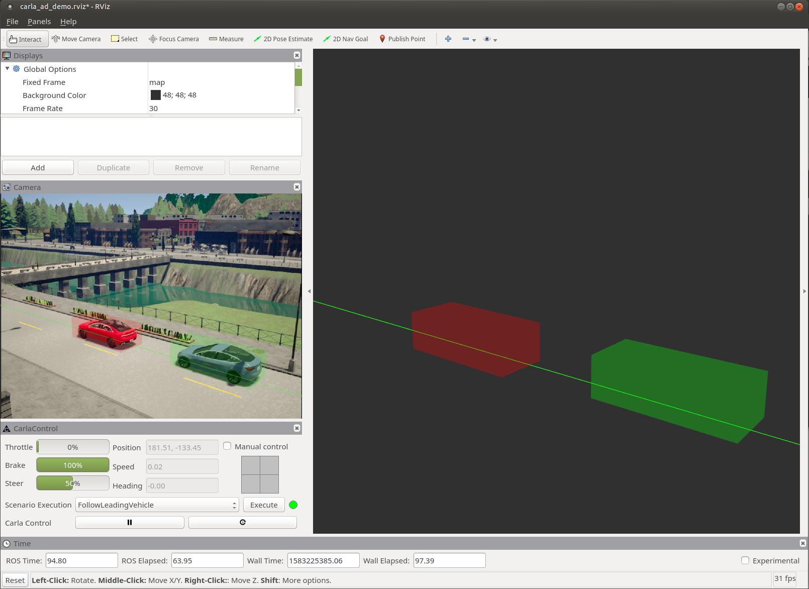

# RVIZ CARLA Control

A [RVIZ](http://wiki.ros.org/rviz) plugin to visualize/control CARLA.

This plugin is expecting a ego vehicle named `ego_vehicle`.

## Features

### Provide the RVIZ view pose to other nodes

In combination with [carla_spectator_camera](../carla_spectator_camera), this allows visually moving around in the CARLA world.

Currently, it is limited to a camera attached to the ego-vehicle. Please set the target frame of the "Current View" to `ego_vehicle`.

### Visualize the current ego vehicle state

The current vehicle state is visualized:

- Vehicle Control
- Position

### Allows manually overriding the ego vehicle vehicle control

By using the drive-widget from the [RVIZ Visualization Tutorials](https://github.com/ros-visualization/visualization_tutorials) and a [node to convert from twist to vehicle control](../carla_twist_to_control) it is possible to steer the ego vehicle by mouse.

### Execute a scenario

By using [carla_ros_scenario_runner](../carla_ros_scenario_runner), it is possible to trigger scenarios from within RVIZ.

### Play/Pause the simulation (if started in synchronous mode)

Similar to the [rqt CARLA plugin](../rqt_carla_plugin), it's possible to control the CARLA world, if synchronous mode is active.

## Topics

### Subscriptions

| Topic               | Type                      | Description                                            |
| ------------------- | ------------------------- | ------------------------------------------------------ |
| `/carla/status`     | [carla_msgs.CarlaStatus](https://github.com/carla-simulator/ros-carla-msgs/tree/master/msg/CarlaStatus.msg) | Read the status of CARLA, to enable/disable the UI |
| `/carla/ego_vehicle/vehicle_status` | [carla_msgs.CarlaEgoVehicleStatus](https://github.com/carla-simulator/ros-carla-msgs/tree/master/msg/CarlaEgoVehicleStatus.msg) | To display the current state of the ego vehicle |
| `/carla/ego_vehicle/odometry` | [nav_msgs.Odometry](http://docs.ros.org/api/nav_msgs/html/msg/Odometry.html) | To display the current pose of the ego vehicle |
| `/scenario_runner/status`     | [carla_ros_scenario_runner_types.CarlaScenarioRunnerStatus](../carla_ros_scenario_runner_types/msg/CarlaScenarioRunnerStatus.msg) | To visualize the scenario runner status |
| `/carla/available_scenarios` | [carla_ros_scenario_runner_types.CarlaScenarioList](../carla_ros_scenario_runner_types/msg/CarlaScenarioList.msg) | For providing a list of scenarios to execute (disabled in combo box) |

### Publications

| Topic               | Type                      | Description                                            |
| ------------------- | ------------------------- | ------------------------------------------------------ |
| `/carla/control`     | [carla_msgs.CarlaControl](https://github.com/carla-simulator/ros-carla-msgs/tree/master/msg/CarlaControl.msg) | Start/pause CARLA |
| `/carla/ego_vehicle/spectator_pose` | [geometry_msgs.PoseStamped](http://docs.ros.org/api/geometry_msgs/html/msg/PoseStamped.html) | Publish the current pose of the RVIZ camera view. |
| `/carla/ego_vehicle/vehicle_control_manual_override` | [std_msgs.Bool](http://docs.ros.org/api/std_msgs/html/msg/Bool.html) | To enable/disable the overriding of the vehicle control |
| `/carla/ego_vehicle/twist` | [geometry_msgs.Twist](http://docs.ros.org/api/geometry_msgs/html/msg/Twist.html) | The twist command, created via mouse |

### Service Client

| Service                                                     | Type | Description                                                         |
| ----------------------------------------------------------- | ---- | ------------------------------------------------------------------- |
| `/scenario_runner/execute_scenario` | [carla_ros_scenario_runner_types.ExecuteScenario](../carla_ros_scenario_runner_types/srv/ExecuteScenario.srv) | Execute the selected scenario |
